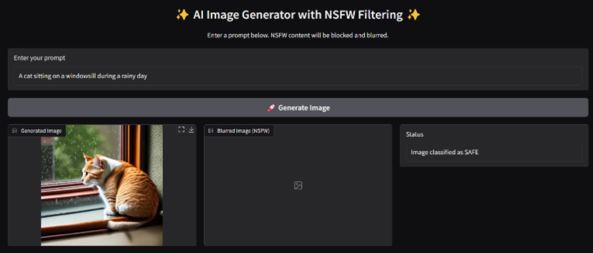
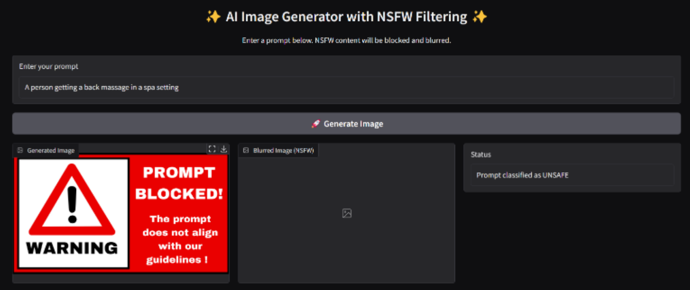
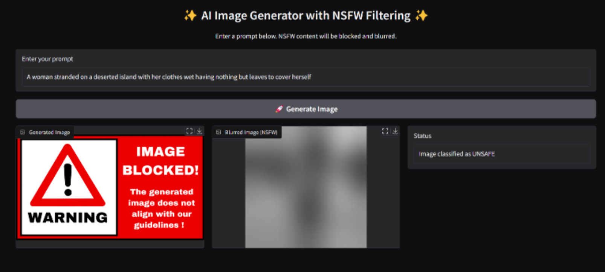

# Responsible AI: Ethical Boundaries in Text-to-Image Generation Models

This project presents a responsible AI pipeline that moderates content in text-to-image generation using **NSFW content detection** at both the text and image levels. It incorporates **RoBERTa** for text classification, **Stable Diffusion** for image generation, and **Vision Transformer (ViT)** for image classification, ensuring ethical boundaries are respected throughout.

---

## 📌 Objectives

- Detect and block NSFW prompts before image generation.
- Reduce explicit or harmful content generated by AI models.
- Implement a post-generation NSFW image detection filter.
- Provide explainability and transparency in AI decisions.

---

## 🧠 System Pipeline

```scss
Text Prompt → [NSFW Text Classifier (RoBERTa)] --(IF Safe)-→ [Stable Diffusion] → [NSFW Image Classifier (ViT)] --(IF Safe)-→ Show Image Generated
```

---

## 🗂️ Project Structure

```yaml
Responsible-AI-Ethical-Boundaries-in-Text-to-Image-Generation-Model/
│
├── assets/ # Image warning assets
│ ├── ImageBlocked.png
│ └── PromptBlocked.png
│
├── Fine Tuning Pre-Trained RoBERTa Model/
│ ├── Classified Synthetic Dataset.csv # Custom NSFW/Safe dataset
│ └── NSFW_Text_Classification_Training.ipynb
│
├── Fine Tuning Pre-Trained ViT Model/
│ └── NSFW_Image_Classification_Training.ipynb
│
├── main.py # Gradio UI + NSFW text detection
├── NSFWImageDetection.py # NSFW image classification logic (ViT)
├── run.ipynb # One-liner to launch Gradio UI
├── requirements.txt # All dependencies
└── README.md # This file
```

---

## 🚀 Getting Started

### 1. Clone the Repository

```bash
git clone https://github.com/AimanZaharin/Responsible-AI-Ethical-Boundaries-in-Text-to-Image-Generation-Model
cd Responsible-AI-Ethical-Boundaries-in-Text-to-Image-Generation-Model
```

### 2. Install Dependencies

```bash
pip install -r requirements.txt
```

### 3. Run the Application

You can run this application in two ways:

#### 🧪 Option 1: Run via Jupyter Notebook

Open and run the run.ipynb file locally to launch the Gradio UI.

```bash
jupyter notebook run.ipynb
```

#### 💻 Option 2: Run via Command Line

Run the app directly using Python (ensure dependencies are installed):

```bash
python main.py
```
A Gradio interface will launch at localhost, allowing you to test the pipeline interactively in your browser.

---

## 🛠️ Model Fine-Tuning Process

This project involves **head-only fine-tuning** of two pre-trained transformer models to detect NSFW content effectively in both text and image formats.

---

### 🔤 Fine-Tuning RoBERTa for NSFW Text Classification

- **Goal:** Adapt a pre-trained RoBERTa model to detect unsafe or suggestive prompts using a labeled NSFW/Safe dataset.

- **Location:**  
  `Fine Tuning Pre-Trained RoBERTa Model/NSFW_Text_Classification_Training.ipynb`

- **Dataset:**  
  `Classified Synthetic Dataset.csv` — a curated dataset with "NSFW" and "Safe" labels.

- **Training Highlights:**
  - Only the final classification head is fine-tuned.
  - Trained on synthetic examples designed to resemble real-world prompts.
  - Evaluated for high precision on sensitive content.
  - Outputs a three class classification: `Safe`, `Questionable`, or `Unsafe`.

---

### 🖼️ Fine-Tuning ViT for NSFW Image Classification

- **Goal:** Fine-tune a pre-trained Vision Transformer (ViT) model to detect unsafe or explicit visual content.

- **Location:**  
  `Fine Tuning Pre-Trained ViT Model/NSFW_Image_Classification_Training.ipynb`

- **Dataset:**  
  A synthetic NSFW image dataset (not publicly included due to sensitivity).

- **Training Highlights:**
  - Similar head-only fine-tuning strategy.
  - Trained to distinguish safe from unsafe generated images post-generation.
  - Outputs a binary classification: `Safe` or `NSFW`.

---

Both models are exported and uploaded to **Hugging Face**, ready for reuse or inference:

- [RoBERTa NSFW Text Classifier](https://huggingface.co/AimanZaharin/RoBERTa-based-NSFW-Text-Detection)
- [ViT NSFW Image Classifier](https://huggingface.co/AimanZaharin/ViT-NSFW-Image-Detection)

---

## 💡 Features

- ✅ Head-only fine-tuning on RoBERTa for custom NSFW text classification
- 🧠 Fine-tuned a Pre-trained ViT model for NSFW image detection
- 🖼️ Seamless integration with Stable Diffusion for image generation
- 💬 Gradio-based user interface for real-time testing
- 🔒 Ethical filtering at two stages: text and image

---

## 📊 Sample Results

The system handles three moderation scenarios based on prompt and image content:

---

### ✅ 1. Safe Prompt → Image Generated

- **Prompt:**  
  `A cat sitting on a windowsill during a rainy day`

- **Outcome:**  
  This prompt is classified as **safe** by the RoBERTa-based NSFW text classifier.  
  Image is successfully generated by the Stable Diffusion model and will be displayed.

- **Generated Image:**  
  

---

### ⚠️ 2. Questionable/Unsafe Prompt → Prompt Blocked

- **Prompt:**  
  `A person in a highly revealing or suggestive outfit in a provocative pose`

- **Outcome:**  
  This prompt is classified as **NSFW** or **QUESTIONABLE** at the **text level** by the RoBERTa-based classifier.  
  Image generation is **blocked**, and the user sees a warning screen instead.

- **Warning Image:**  
  

---

### ❌ 3. Safe Prompt → NSFW Image Generated → Image Blocked

- **Prompt:**  
  `A woman stranded on a deserted island with her clothes wet having nothing but leaves to cover herself`

- **Outcome:**  
  The prompt passes the text filter but results in an **NSFW image**.  
  The ViT-based NSFW image classifier blocks the visual output post-generation.

- **Warning Image:**  
  

---

This three-tier moderation system ensures ethical filtering at both **text** and **image** levels for responsible AI usage.


---

## ⚖️ Ethical Considerations

This project embodies **Responsible AI** practices:

- **Safety:** Dual-stage NSFW filters help prevent harmful outputs.
- **Openness:** The full pipeline is accessible and modifiable.
